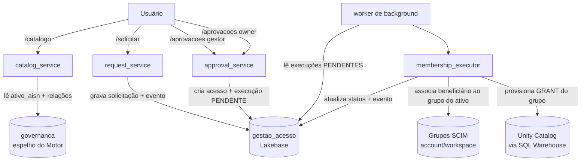

# Arquitetura do App — Rotas e Fontes de Dados

Doc técnica do **Marketplace de Dados** (Flask + Jinja2 no Databricks Apps). Explica
**quais rotas existem**, **o que cada uma faz** e **de onde busca/grava os dados**.
Complementa `README.md` (visão geral), `DEPLOY.md` (deploy) e `DECISIONS.md` (decisões).

---

## 1. Camadas

```
Navegador
   │  (HTTP, SSO X-Forwarded-Email; em dev, proxy "atuar como")
   ▼
Flask (app/) ── blueprints (app/routes/*) ── camada fina: lê o form, resolve o usuário,
   │                                          chama um serviço e renderiza um template.
   ▼
Serviços (app/services/*) ── regras de negócio + SQL. É AQUI que os dados são lidos/gravados.
   │
   ├─▶ Lakebase (Postgres)         via app/db.py  (psycopg, OAuth 1h)
   │      ├─ schema governanca      → LEITURA (espelho do Motor)
   │      └─ schema gestao_acesso   → LEITURA/ESCRITA (estado do app)
   ├─▶ Unity Catalog               via scripts/uc_sql.run_uc_sql (SQL Warehouse)
   │      └─ GRANT/REVOKE do GRUPO DO ATIVO nos objetos (provisionamento)
   └─▶ Grupos SCIM                 via app/db.get_groups_client()
          └─ associar/desassociar o beneficiário no grupo do ativo (a CONCESSÃO)
```

### Diagrama de fluxo (concessão de acesso)



---

## 2. Fontes de dados (onde o app busca)

| Fonte | Como o app acessa | Papel | Leitura/Escrita |
|---|---|---|---|
| **`governanca.*`** (16 tabelas do modelo) | `app/db.py` (Postgres) | **Catálogo/modelo**: domínios, subdomínios, iniciativas, camadas, ICAs, tabelas, usuários, hierarquia, grupos, **ativos** e **owners**. Espelho do Delta (Motor de Governança) via synced tables (prod) / sync controlado (dev). | **Somente leitura** pelo app |
| **`gestao_acesso.*`** | `app/db.py` (Postgres) | **Estado operacional**: solicitação → autorização → aprovação → acesso → execução técnica → revogação → eventos. Nativo no Lakebase. | **Leitura e escrita** |
| **Unity Catalog** | `scripts/uc_sql.run_uc_sql` (SQL Warehouse) | Alvo dos `GRANT/REVOKE` reais — concedidos ao **grupo do ativo** nos objetos resolvidos (provisionamento). | Escrita (DDL/DCL) |
| **Grupos (SCIM)** | `app/db.get_groups_client()` → AccountClient (prod) ou WorkspaceClient (dev) | **A concessão em si**: incluir/remover o beneficiário (usuário ou grupo exploratório) no **grupo do ativo**. | Leitura/escrita SCIM |

> **`governanca` é espelho.** O app nunca grava em `governanca`; ela vem do Motor do
> cliente (Delta → synced tables). Só `gestao_acesso` é transacional. Ver `DECISIONS.md`
> D-010/D-011.

---

## 3. Identidade do usuário (`app/identity.py`)

`usuario_atual()` resolve o usuário corrente por ordem de precedência:
1. **Proxy** (dev/demo): `session["proxy_user_id"]` — seletor "Atuar como" (D-005).
2. **SSO** (produção): header `X-Forwarded-Email` do Databricks Apps → `usuario_por_email`.
3. **Fallback dev**: `DEV_FALLBACK_EMAIL`.

O e-mail é casado em `governanca.usuario_aisn` (`desc_email`). Se autenticado mas não
mapeado, retorna um stub só com e-mail (sem `id_usuario_aisn`). Os **papéis** (`gestor`,
`owner`) e os grupos do usuário são injetados em todos os templates por um
`context_processor` em `app/__init__.py` (gestor = existe em `hierarquia_usuario` como
gestor; owner = existe em `ativo_proprietario`).

---

## 4. Rotas (o que cada uma faz e de onde busca os dados)

Legenda de fontes: **G** = `governanca.*` (leitura), **A** = `gestao_acesso.*`,
**UC** = Unity Catalog (warehouse), **SCIM** = grupos.

### `main` (`app/routes/main.py`)
| Método | Rota | Faz | Fontes |
|---|---|---|---|
| GET | `/` | redireciona p/ `/catalogo` | — |
| GET | `/health` | healthcheck `{"status":"ok"}` | — |
| POST | `/proxy` | troca o usuário atuante (dev) | sessão |

### `catalog` (`app/routes/catalog.py`) — serviço `catalog_service`
| Método | Rota | Faz | Fontes |
|---|---|---|---|
| GET | `/catalogo` | lista **ativos** (driver = `ativo_aisn`), filtros por nível/domínio/subdomínio/busca; breadcrumb derivado polimorficamente | **G**: `ativo_aisn` + `iniciativa_camada_ambiente`/`tabela_aisn`/`iniciativa_aisn`/`subdominio_informacao`/`dominio_informacao` + `grupo_acesso` + `ativo_proprietario` + `usuario_aisn` |
| GET | `/ativo/<id_ativo>` | detalhe do ativo: owners, grupo, **escopo UC resolvido** (`ativo_scope`) e formulário de solicitação | **G**: idem + `grupo_acesso_membro` (grupos do usuário) |

### `requests` (`app/routes/requests.py`) — serviço `request_service`
| Método | Rota | Faz | Fontes |
|---|---|---|---|
| POST | `/solicitar` | cria solicitação p/ um ativo (nominal ou grupo); valida RN-005/007/010/013/014 | lê **G**: `ativo_aisn`, `ativo_proprietario`, `grupo_acesso_membro`, `hierarquia_usuario`, `usuario_aisn`; grava **A**: `solicitacao_acesso` + `evento_ciclo_vida` |
| GET | `/minhas-solicitacoes` | solicitações do usuário + status do acesso | **A**: `solicitacao_acesso` + **A** `acesso`; **G**: joins do ativo |
| GET | `/solicitacao/<id>` | detalhe + escopo UC + histórico + etapa pendente | **A**: `solicitacao_acesso`, `acesso`, `evento_ciclo_vida`; **G**: ativo + `ativo_proprietario` |
| POST | `/solicitacao/<id>/cancelar` | cancela (RN-011) | grava **A**: `solicitacao_acesso`, `evento_ciclo_vida` |

### `approvals` (`app/routes/approvals.py`) — serviço `approval_service`
| Método | Rota | Faz | Fontes |
|---|---|---|---|
| GET | `/aprovacoes` | fila do gestor (hierarquia) + fila do owner (do ativo) | **A**: `solicitacao_acesso`; **G**: `hierarquia_usuario`, `ativo_proprietario`, ativo |
| POST | `/aprovacoes/<id>/gestor` | autoriza/reprova (RN-013/014) | grava **A**: `autorizacao_hierarquica`, `solicitacao_acesso`, `evento` |
| POST | `/aprovacoes/<id>/owner` | aprova/reprova (RN-006/017); se aprova, **cria o acesso** | lê **G**: `ativo_proprietario`; grava **A**: `aprovacao_owner`, `solicitacao_acesso`, `acesso`, `execucao_tecnica` (PENDENTE), `evento` |

### `accesses` (`app/routes/accesses.py`) — serviço `access_service`
| Método | Rota | Faz | Fontes |
|---|---|---|---|
| GET | `/meus-acessos` | acessos do usuário (nominal + por grupo) + acesso padrão de owner (RN-016/025) | **A**: `acesso`; **G**: ativo + `grupo_acesso_membro`; `ativo_proprietario` |
| GET | `/acessos-owner` | acessos concedidos no escopo do owner | **A**: `acesso`; **G**: ativo + `ativo_proprietario` + `usuario_aisn` + `grupo_acesso` |
| POST | `/acesso/<id>/revogar` | solicita revogação (RN-026) | lê **G**: `ativo_proprietario`; grava **A**: `revogacao_acesso`, `execucao_tecnica` (PENDENTE), `evento` |
| POST | `/acesso/<id>/reprocessar` | reenfileira execução (RF-079/080) | grava **A**: `execucao_tecnica` (PENDENTE) |

### `audit` (`app/routes/audit.py`) — serviço `audit_service`
| Método | Rota | Faz | Fontes |
|---|---|---|---|
| GET | `/auditoria` | trilha restrita ao escopo do owner (RF-088) | **A**: `solicitacao_acesso` + `acesso`; **G**: ativo + `ativo_proprietario` + `usuario_aisn` + `grupo_acesso` |
| GET | `/resumo-dominio` | agregados por domínio (nº ativos, acessos, solicitações) — domínio derivado polimorficamente | **G**: `dominio_informacao` + `ativo_aisn`; **A**: `acesso`, `solicitacao_acesso` |

---

## 5. O ativo como driver (resolução polimórfica)

O catálogo gira em torno de **`ativo_aisn`**. Não há colunas denormalizadas: **`id_ativo_aisn`
É a PK da entidade de origem** e **`cod_tipo_ativo`** (código numérico) diz onde resolver:

| `cod_tipo_ativo` | Origem (`id_ativo_aisn` = PK dela) | Escopo UC resolvido |
|---|---|---|
| `1` = ICA | `iniciativa_camada_ambiente` | 1 schema (`ON SCHEMA`) |
| `2` = TABELA | `tabela_aisn` | 1 tabela (`ON TABLE`) |
| `3` = SUBDOMINIO | `subdominio_informacao` | N schemas (expande) |
| `4` = DOMINIO | `dominio_informacao` | N schemas (expande) |

`app/services/ativo_scope.py` centraliza isto:
- `objetos_do_ativo(ativo)` → lista de objetos UC concretos p/ o grant/exibição;
- `ativo_join(alias)` / `ativo_cols(alias)` → um `LEFT JOIN` polimórfico reutilizado por
  todos os serviços que reconstrói breadcrumb (`nome_dominio`, `nome_subdominio`), alvo UC
  (`nome_catalogo`/`nome_schema`/`nome_tabela`) e `tipo_label` **com os mesmos aliases** —
  por isso os templates não precisaram mudar;
- `dominio_id_expr()` / `subdominio_id_expr()` → expressões para filtrar em `WHERE`.

O **owner** do ativo vem de `ativo_proprietario`; o **grupo do ativo** de
`ativo_aisn.id_grupo_acesso → grupo_acesso`.

---

## 6. Concessão por associação a grupo (efetivação)

Aprovado pelo owner, o acesso não é um `GRANT` por usuário — é uma **associação a grupo**:

1. `approval_service.decidir_aprovacao_owner` cria `acesso` (AGUARDANDO) + `execucao_tecnica`
   PENDENTE.
2. O **worker** (`app/worker.py`, poll ~15s, advisory lock p/ múltiplos gunicorn) chama
   `access_service.processar_execucoes_pendentes`, que delega a
   `membership_executor.executar`:
   - resolve o **grupo do ativo** (`ativo_aisn.id_grupo_acesso`);
   - **CONCESSÃO** → inclui no grupo o beneficiário (**nominal**→usuário; **grupo**→grupo
     exploratório aninhado) via SCIM, e **provisiona** (best-effort) o `GRANT` do grupo nos
     objetos UC (`grant_executor.provisionar_ativo`, via warehouse);
   - **REVOGAÇÃO** → remove o membro do grupo.
3. Atualiza `acesso.cod_status_acesso` (EFETIVADO/REVOGADO/ERRO), `execucao_tecnica` e grava
   `evento_ciclo_vida`.

**Escopo dos grupos (`config.GROUPS_SCOPE`)** — `db.get_groups_client()` decide o cliente SCIM:
- **`account`** (produção): grupos de **conta** (principais válidos no UC → o `GRANT` do
  grupo propaga). Exige `DATABRICKS_ACCOUNT_ID` e o **SP do app como gerente** desses grupos.
- **`workspace`** (dev sem conta): grupos workspace-local; a associação é real e verificável,
  mas o `GRANT` do grupo **não propaga** no UC (`PRINCIPAL_DOES_NOT_EXIST` — limitação D-009).
  Em dev, o SP precisa poder gerenciar grupos do workspace (ex.: estar em `admins`).

---

## 7. Resumo por serviço

| Serviço | Arquivo | Responsabilidade | Grava em |
|---|---|---|---|
| `catalog_service` | `services/catalog_service.py` | vitrine de ativos + detalhe + escopo | — (só lê) |
| `request_service` | `services/request_service.py` | criar/listar/cancelar solicitação, regras, hierarquia/grupos | `gestao_acesso` |
| `approval_service` | `services/approval_service.py` | filas + decisões (gestor/owner) | `gestao_acesso` |
| `access_service` | `services/access_service.py` | acessos, revogação, **worker de efetivação** | `gestao_acesso` |
| `membership_executor` | `services/membership_executor.py` | **concessão = associação ao grupo** (SCIM) + provisiona GRANT | SCIM + UC |
| `grant_executor` | `services/grant_executor.py` | monta e executa GRANT/REVOKE do grupo nos objetos | UC |
| `ativo_scope` | `services/ativo_scope.py` | resolução polimórfica ativo → objetos UC + JOIN de detalhes | — |
| `audit_service` | `services/audit_service.py` | trilha de eventos + resumo por domínio | `gestao_acesso` (eventos) |
